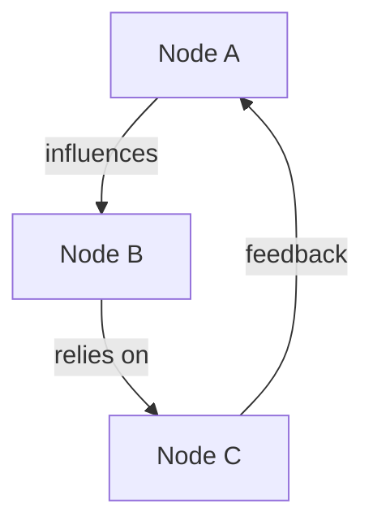

# System Hub (Concept Map)

> **System / Topic:** [Central topic or problem]
> **Purpose:** [What question or system boundary this map addresses]

---

## 1. Core Hub
*The central focus or system under analysis.*

- **Core Hub Concept:** [Describe the central topic]
- **Scope Statement:** [What is inside and outside of this map's direct modeling?]

---

## 2. Components / Nodes
*The variables, concepts, or assets that comprise the system.*

| ID | Component / Node | Description | Type | Status |
|---|---|---|---|---|
| A | [Name] | [Description] | [Input/Process/Output/Constraint] | [Active/At Risk] |
| B | [Name] | [Description] | [Input/Process/Output/Constraint] | [Active/At Risk] |

---

## 3. Connections / Links
*Directional relationships between components. Format: A influences B.*

| From Node | To Node | Relationship Type | Description | Strength |
|---|---|---|---|---|
| [A] | [B] | [causes / relies on / contradicts] | [How these relate] | [High/Med/Low] |

### Feedback Loops
- **Loop 1:** [e.g., A → B → A (reinforcing or balancing loop)]

---

## 4. System Boundary and Environment
- **Included:** [What falls inside scope]
- **Excluded:** [Deliberately omitted variables]
- **External Influences:** [Factors outside control affecting nodes]

---

## 5. Leverage Points and Interventions
*High-impact spots where modifications yield maximum system optimization.*

| # | Leverage Point | Rationale for Impact | Proposed Intervention | Owner |
|---|---|---|---|---|
| 1 | [Node or Connection] | [Why this is high-leverage] | [Proposed action] | [Name] |

---

## 6. Visual Map (Mermaid Diagram)

