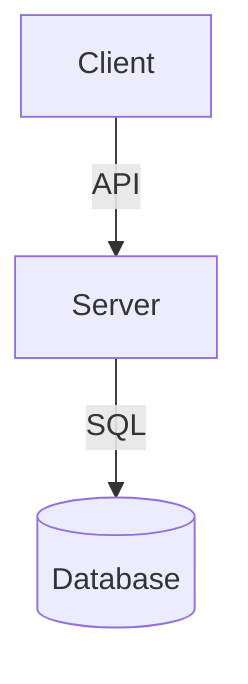

# SDLC Project: [Project Name]

> **Project Lead:** [Name]  
> **Repository/Workspace:** [URL or local path]  
> **Phase:** [Planning/Development/Testing/Production]

---

## 1. Project Overview & Scope
- **Problem Statement:** [What issue does this project solve?]
- **Target Audience:** [Who will use this?]
- **Success Criteria:** [How do we know the project is successful?]

---

## 2. Technical Architecture & Design
- **Stack / Technologies:** [Languages, frameworks, databases]
- **Key Modules / Directories:**
  - `module_a/` - [Module description]
- **Mermaid Architecture Diagram:**

---

## 3. Milestone Roadmap
| Milestone | Description | Target Date | Status |
|---|---|---|---|
| M1 | [Milestone description] | [Date] | [Not Started/In Progress/Done] |
| M2 | | | |

---

## 4. Sprint Task Board
*Track active development tasks here.*

### 🚀 High Priority (Current Sprint)
- [ ] **[Task ID / Name]** — Owner: [Name] | [Description]
- [ ] **[Task ID / Name]** — Owner: [Name] | [Description]

### 📥 Backlog (Future Sprints)
- [ ] **[Task Name]** — [Details]

###  Completed
- [x] **[Task Name]** — [Accomplished details]

---

## 5. Testing & Verification Plan
- **Unit Tests Command:** `[e.g. pytest path/to/tests]`
- **Integration/E2E Tests:** `[e.g. manual verification steps]`
- **Lint/Quality Checks:** `[e.g. flake8 or pylint]`
